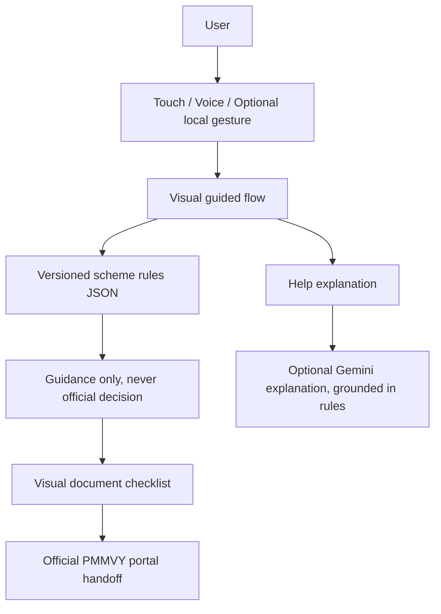

# SakhiCare AI

**Your voice. Your language. Your government service.**

SakhiCare is a visual accessibility and guidance layer for women navigating government services. This MVP demonstrates one PMMVY guidance journey in English and Tamil. It is not a government portal and does not submit an application.

## The problem and solution

First-time and rural users can face language, literacy, and interface barriers when accessing services. SakhiCare presents one illustrated question at a time and accepts touch, speech, or a small set of navigation gestures. It turns confusion into a simple visual explanation, then hands the user to the official service.

Unlike a chatbot-first design, the main experience is a visual guided flow. It does not ask Gemini to decide eligibility. Scheme data and document guidance are stored in a versioned JSON rules file; any eligibility result is explicitly guidance only.

## Features

- Mobile-first welcome, three-question guidance flow, result, visual document checklist, handoff confirmation, and completion screens.
- English and Tamil interface and browser speech output; browser speech recognition where supported, with touch fallback.
- First-visit Follow Me guide auto-opens once per browser, demonstrates the tap/answer/voice/gesture/portal path, can be skipped, and can be replayed from the welcome screen.
- A separate Sakhi chat screen provides text conversation, image/document attachments, and hands-free Realtime voice conversation. It uses SakhiCare's own visual design rather than copying ChatGPT's interface.
- Voice capture can use local multilingual Whisper language detection and transcription. The detected language is passed to Gemini for a same-language response; audio reply uses Gemini TTS when configured, then a matching installed browser voice. Text and touch remain available when either voice provider is unavailable.
- Optional local browser camera gesture recognition using MediaPipe Tasks Vision. Frames are processed in the browser and never sent to the backend. Gesture vocabulary: thumbs up = yes, thumbs down = no, index pointing = next/back, open hand = help. Touch buttons always remain available.
- Demo Mode labels sample answers and makes the journey work without the API or Gemini.
- FastAPI endpoints for health, scheme data, chat explanation, guidance evaluation, and in-memory demo sessions.
- Reduced-motion support, keyboard focus indicators, semantic controls, and large touch targets.

## Architecture



## Technology

- Frontend: React, TypeScript, Vite, Tailwind CSS, Lucide, MediaPipe Tasks Vision.
- Backend: FastAPI, Pydantic, Python; modular JSON scheme configuration.
- Optional AI: Google's recommended Gemini Interactions REST API, called only by the backend with `store: false`. Without a key or if a request fails, a short localized fallback is used where available.
- Sakhi conversation: OpenAI Responses API for typed chat and supported file inputs, plus OpenAI Realtime API over browser WebRTC for speech-to-speech. The server creates short-lived Realtime client secrets; the standard API key stays on the server. Configure `OPENAI_API_KEY`, `OPENAI_TEXT_MODEL` (default `gpt-4.1-mini`) and `OPENAI_REALTIME_MODEL` (default `gpt-realtime-2.1`).
- Storage: SQLite stores only a random session ID, language, demo flag, and scheme ID. Answers and personal identifiers are never stored.

## PMMVY facts and sources

Facts live in `backend/app/rules/pmmvy_rules.json`, independently from prompt text and application logic. Sources reviewed 2026-10-01:

- [Ministry of Women and Child Development PMMVY offering](https://wcd.gov.in/offerings/pradhan-mantri-matru-vandana-yojana)
- [SPNIWCD PMMVY FAQ](https://spniwcd.wcd.gov.in/pradhan-mantri-matru-vandana-yojna/faqs)
- [Official PMMVY application portal](https://pmmvy.wcd.gov.in/)

Official pages describe PMMVY categories and supporting documents. The MVP's three questions do not establish eligibility; the result is only general guidance and the official portal or an Anganwadi worker must confirm the case. Verify current terms at the official source.

## Run locally

### Backend

```powershell
cd backend
py -3.11 -m venv .venv
.\.venv\Scripts\Activate.ps1
pip install -r requirements.txt
Copy-Item .env.example .env
uvicorn app.main:app --reload --port 8000
```

Set `GEMINI_API_KEY` in `backend/.env` to enable short rule-grounded explanations. `GEMINI_MODEL` defaults to `gemini-2.5-flash`. The model is instructed to explain sourced facts only; the server sends requests with `store: false`. No API key is needed for the sample flow.

Set `OPENAI_API_KEY` in `backend/.env` to enable the Sakhi chat screen. Text chat uses the Responses API with `store: false`; conversation history is held in the browser tab and sent for each turn. Up to four supported attachments (images, PDF, text, common office documents and spreadsheets) are accepted, with a 10 MB per-file and 15 MB total limit. Live voice requests microphone access after the user taps the voice control and uses WebRTC with a short-lived Realtime client secret. The OpenAI API key is never sent to the browser. Provider account access and usage billing are required for these AI features; without the key, the chat screen explains that setup is needed. Keep personal identifiers out of uploaded files and chat.

The Speak path defaults to `ASR_PROVIDER=auto`: when `OPENAI_API_KEY` is configured it uses OpenAI's recommended `gpt-transcribe` model, with prompt context for Indian languages and PMMVY terms, and uses the model's detected language for its response. Without an OpenAI key, it falls back to local `faster-whisper` with the multilingual `small` model on CPU/int8. The local checkpoint downloads on the first voice request and needs internet access and several hundred MB. Configure `ASR_PROVIDER=openai` or `whisper` to select one explicitly, and set `OPENAI_TRANSCRIBE_MODEL` or `WHISPER_MODEL` to choose a model. Language detection covers many languages but not every dialect or mother tongue; accuracy depends on recording quality. The short PMMVY yes/no classifier only recognizes explicit common-language vocabulary; other transcripts are shown without guessing an answer.

Set `GEMINI_API_KEY` to enable translated response generation and `GEMINI_TTS_MODEL` (default `gemini-3.8-flash-lite-tts`) for generated spoken replies. Without the key, local-language fallback text is available for common Indian languages; the browser may speak it only if a matching voice is installed. Other languages remain text-first. The API never silently substitutes English as a voice reply.

### Frontend

```powershell
cd frontend
npm install
Copy-Item .env.example .env
npm run dev
```

Open `http://localhost:5173`. Set `VITE_API_BASE_URL` in `frontend/.env` if the backend uses a different address. The illustrated demo journey works independently of the backend.

## Demo Mode and hackathon flow

1. Open SakhiCare and select Tamil using the language control.
2. Start the PMMVY visual flow. Try YES, NEXT, HELP, and the camera only if desired.
3. Answer the first two questions with the visible controls and speak the third answer if the browser supports speech recognition.
4. Review the explicitly non-binding guidance and visual checklist.
5. Select **What is this?** for a short explanation, then **Open official application**.
6. Confirm the handoff. The official portal opens only after the user selects the portal link; SakhiCare never submits the application.

Demo Mode is clearly labeled on journey screens. Answers are sample interaction state in the browser and are not mixed into the government rules data.

## Privacy and accessibility

The optional camera stream is processed locally by MediaPipe and stopped when leaving the flow or turning the camera off. Voice audio is sent to the local backend for transcription, processed in memory, and not saved; a detected transcript is sent to Gemini only when the API key is configured, with provider storage disabled. Camera or microphone permission can be declined; large touch controls remain available. No name, Aadhaar, phone, answer, or other personal identifier is requested or stored. The backend does not log request bodies. Use HTTPS for camera access outside localhost.

The UI uses keyboard-operable native buttons and links, visible focus, responsive layouts, and reduced-motion preferences. Browser speech and Tamil voice availability depend on the user's device/browser; text and touch remain the fallback.

## Roadmap

1. PMMVY visual, gesture, and voice MVP.
2. More women-focused schemes.
3. More Indian languages.
4. Indian Sign Language support with appropriate research and validation.
5. More government services.
6. State-specific schemes.
7. Personalized government-service navigator.

## Tests and build

```powershell
cd backend
pip install -r requirements.txt
pytest

cd ../frontend
npm install
npm run build
```
# ShathiCare

